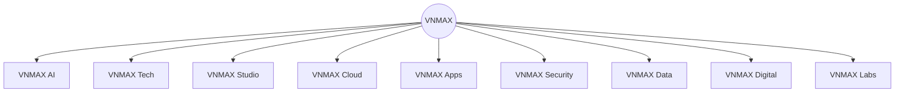

# Prompt 05 - VNMAX Ecosystem Units

## Objetivo

Padronizar as divisoes da VNMAX, suas cores, plataformas e papeis dentro do ecossistema.

## Mapa do ecossistema

## Divisoes

### VNMAX AI

- Cor: amarelo `#F5D342`.
- Slogan: Inteligencia que trabalha por voce.
- Plataforma: VNMAX Nexus.
- Produtos: Nexus Chat, Nexus Agent, Nexus Voice, Nexus Vision, Nexus OCR, Nexus Flow, Nexus Search, Nexus API.
- Objetivo: automatizar empresas atraves de IA.

### VNMAX Tech

- Cor: azul `#2F7BFF`.
- Slogan: Transformando ideias em software.
- Plataforma: VNMAX Forge.
- Produtos: Forge ERP, Forge CRM, Forge API, Forge Gateway, Forge Runtime, Forge Identity, Forge SDK.
- Objetivo: criar sistemas corporativos, APIs e SaaS.

### VNMAX Studio

- Cor: laranja `#FF8A3D`.
- Plataforma: VNMAX Canvas.
- Produtos: Canvas Brand, Canvas UI, Canvas UX, Canvas Motion, Canvas Web, Canvas Identity.
- Objetivo: criar experiencias digitais modernas.

### VNMAX Cloud

- Cor: verde `#36D399`.
- Plataforma: VNMAX Orbit.
- Produtos: Orbit Compute, Orbit Storage, Orbit Backup, Orbit DNS, Orbit Mail, Orbit CDN, Orbit Containers.
- Objetivo: hospedar e operar infraestrutura tecnologica.

### VNMAX Security

- Cor: vermelho `#FF4D4F`.
- Plataforma: VNMAX Shield.
- Produtos: Shield Defender, Shield Firewall, Shield Sentinel, Shield Vault, Shield Pentest, Shield WAF.
- Objetivo: garantir seguranca digital para empresas.

### VNMAX Data

- Cor: ciano `#22D3EE`.
- Plataforma: VNMAX Insight.
- Produtos: Insight BI, Insight Analytics, Insight Dashboards, Insight Reports, Insight Warehouse, Insight Forecast.
- Objetivo: transformar dados em inteligencia para decisao.

### VNMAX Apps

- Cor: roxo `#9B5CFF`.
- Plataforma: VNMAX Pulse.
- Produtos: Pulse Mobile, Pulse Wallet, Pulse Delivery, Pulse Business, Pulse Client.
- Objetivo: desenvolver aplicativos modernos para empresas.

### VNMAX Digital

- Cor: rosa `#FF5DA2`.
- Plataforma: VNMAX Growth.
- Produtos: Growth Ads, Growth SEO, Growth CRM, Growth Social, Growth Funnels.
- Objetivo: gerar crescimento via marketing digital.

### VNMAX Labs

- Cor: branco `#F8FAFC`.
- Plataforma: VNMAX Nova.
- Produtos: Nova Quantum, Nova Robotics, Nova XR, Nova IoT, Nova Research.
- Objetivo: pesquisar tecnologias emergentes e criar inovacao para o ecossistema.

## Regra de expansao

Cada divisao so deve ser comunicada como oferta ativa quando houver capacidade real de entrega, processo de atendimento, precificacao minima e responsavel operacional.
