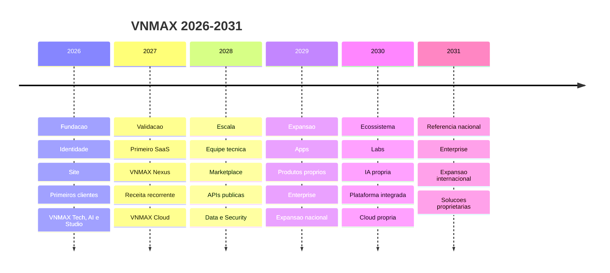

# Prompt 08 - Strategic Roadmap 2026-2031

## Objetivo

Definir o plano estrategico macro da VNMAX para apresentacoes institucionais, planejamento interno e alinhamento de produto.

## Linha do tempo

## 2026 - Construcao

Objetivo: construir a empresa.

Entregas:

- Fundacao da VNMAX.
- Identidade visual.
- Lancamento do site.
- Estruturacao da marca.
- Definicao dos bracos da empresa.
- Portfolio inicial.
- Primeiros clientes e contratos.
- Primeiros sistemas.
- Lancamento de VNMAX Tech, VNMAX AI e VNMAX Studio.

## 2027 - Validacao

Objetivo: validar mercado.

Metas:

- Primeiro SaaS.
- VNMAX Nexus.
- Primeiros agentes de IA.
- Receita recorrente.
- 30 clientes ativos.
- Lancamento da VNMAX Cloud.
- Processos internos definidos.
- Documentacao tecnica.

## 2028 - Escala

Objetivo: escalar.

Metas:

- Equipe tecnica estruturada.
- Marketplace.
- APIs publicas.
- Aplicativo VNMAX.
- VNMAX Data.
- VNMAX Security.
- Mais de 100 clientes.
- Infraestrutura propria.

## 2029 - Expansao

Objetivo: expandir.

Metas:

- VNMAX Apps.
- Produtos proprios.
- Marketplace consolidado.
- Clientes Enterprise.
- Expansao nacional.
- Novos parceiros.

## 2030 - Ecossistema

Objetivo: integrar o ecossistema.

Metas:

- VNMAX Labs.
- Projetos open source.
- IA propria.
- Plataforma integrada.
- Cloud propria.

## 2031 - Referencia nacional

Objetivo: consolidar a VNMAX como referencia nacional.

Metas:

- Ecossistema completo.
- Produtos Enterprise.
- Expansao internacional.
- Solucoes proprietarias.
- Empresa consolidada.

## Regra de uso

Este documento nao deve aparecer em landing pages publicas. Use apenas em apresentacoes institucionais, planejamento interno, proposta estrategica ou comunicacoes autorizadas.
