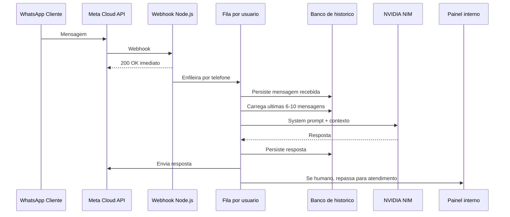

# Prompt 11 - WhatsApp + NVIDIA Node Blueprint

## Objetivo

Definir a arquitetura para um microsservico Node.js que conecte a API Oficial do WhatsApp da Meta ao NVIDIA API Catalog/NIM usando um endpoint OpenAI-compatible.

## Fluxo de dados



## Componentes

- Webhook HTTP: recebe GET de verificacao e POST de mensagens.
- Gerenciador de fila: uma fila por telefone, processando em ordem.
- Historico: persistencia de mensagens por `wa_id`.
- Orquestrador de IA: monta system prompt e janela de contexto.
- Transbordo humano: muda status de atendimento e para de chamar IA.
- Cliente Meta: envia mensagens via Cloud API.
- Cliente NVIDIA: usa SDK OpenAI com `baseURL` configuravel.

## Regras criticas

### Estado e memoria

Endpoints de IA sao stateless. O servico deve persistir cada mensagem recebida e enviada. A cada chamada, montar:

1. System prompt.
2. Dados oficiais permitidos.
3. Ultimas 6 a 10 mensagens.
4. Mensagem atual.

Mensagens antigas nao devem entrar no prompt atual, salvo resumo aprovado.

### Concorrencia

O webhook deve responder `200 OK` rapidamente para a Meta e processar mensagens em fila. Um mesmo telefone nao pode ter duas respostas geradas ao mesmo tempo.

MVP permitido:

- Fila em memoria por telefone.

Producao recomendada:

- BullMQ + Redis.
- Idempotencia por `message_id`.
- Retry com backoff.
- Dead-letter queue.

### Transbordo humano

Cada contato deve ter status:

- `bot`: IA responde.
- `humano`: IA nao responde; mensagem vai para painel.

Gatilhos:

- "falar com atendente".
- "humano".
- "suporte".
- Forte insatisfacao detectada.
- Falha repetida da IA.

A IA deve encerrar resposta de transbordo com `[TRANSBORDO_HUMANO]`.

## Configuracao NVIDIA

- Base URL cloud: `https://integrate.api.nvidia.com/v1`.
- Endpoint chat: `/chat/completions`.
- Cliente: SDK OpenAI-compatible.
- Temperatura recomendada: `0.3` a `0.5`.
- Modelo: escolher no catalogo conforme latencia, custo e qualidade.

## Variaveis de ambiente

```env
WHATSAPP_VERIFY_TOKEN=
WHATSAPP_ACCESS_TOKEN=
WHATSAPP_PHONE_NUMBER_ID=
NVIDIA_API_KEY=
NVIDIA_BASE_URL=https://integrate.api.nvidia.com/v1
NVIDIA_MODEL=
BOT_TEMPERATURE=0.4
CONTEXT_WINDOW_MESSAGES=8
HUMAN_HANDOFF_KEYWORDS=falar com atendente,humano,suporte
```

## System prompt base

Use o prompt em `../05_ai/02_whatsapp_system_prompt.md`.

## Seguranca

- Validar o token de verificacao da Meta no GET.
- Validar assinatura do webhook quando disponivel.
- Nao logar tokens, telefone completo ou dados sensiveis.
- Aplicar rate limit por telefone.
- Guardar secrets fora do repositorio.
- Implementar allowlist de eventos aceitos.

## Checklist de producao

- Webhook responde rapido.
- Mensagens duplicadas sao ignoradas por idempotencia.
- Fila por usuario garante ordem.
- Historico limita contexto.
- Transbordo humano funciona.
- Logs estruturados sem dados sensiveis.
- Falhas da NVIDIA geram resposta segura ou encaminhamento.
- Testes cobrem webhook, fila, contexto e transbordo.
