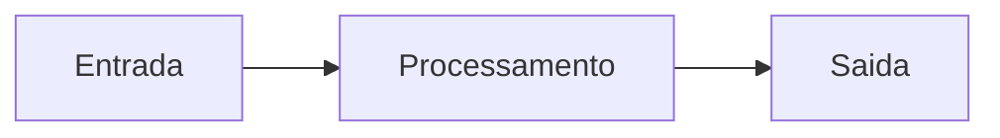

# Template - Request for Comments

## Titulo

RFC-000 - Nome da proposta

## Resumo

Explique a proposta em ate cinco linhas.

## Problema

Qual problema real esta sendo resolvido?

## Objetivos

- 

## Fora de escopo

- 

## Proposta

Descreva a solucao em detalhes suficientes para revisao.

## Arquitetura

Inclua diagrama Mermaid quando ajudar.

## Seguranca

Quais dados sensiveis existem? Como serao protegidos?

## Observabilidade

Quais logs, metricas, traces e alertas serao criados?

## Testes

Quais testes validam a proposta?

## Migracao

Como a mudanca sera entregue sem quebrar fluxo existente?

## Riscos

- 

## Criterios de aceite

- 
